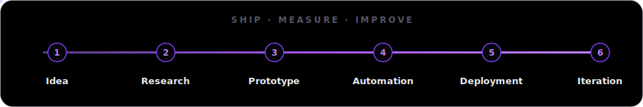

<!--
  ╔══════════════════════════════════════════════════════════════╗
  ║  REHAN NAZIR · AI Production Systems Engineer                  ║
  ║  Profile README — animated SVGs live in /assets (self-hosted). ║
  ║  Live-stat cards use standard community services (see note in  ║
  ║  the "Signals" section). Everything else is self-contained.    ║
  ╚══════════════════════════════════════════════════════════════╝
-->

 

&nbsp;

&nbsp;

&nbsp;

 

## `01` — Live Status

## `02` — Engineering Philosophy

> **I build systems that run without me in the loop.**
>
> Models are commodities — reliability is not. My work lives at the boundary
> where an LLM stops being a demo and starts being infrastructure: typed
> outputs, retries, observability, and orchestration that survives real traffic.
>
> **Ship products, not certificates. Optimize for what reaches production.**

## `03` — What I Build

<table>
<tr>
<td width="33%" valign="top">

### 🤖 AI Agents
Autonomous, tool-using agents that plan, call APIs, and act — not chatbots.

</td>
<td width="33%" valign="top">

### 📚 RAG Systems
Retrieval pipelines over vector stores with grounded, cited answers.

</td>
<td width="33%" valign="top">

### ⚙️ Automation
End-to-end business workflows in n8n that remove repetitive human work.

</td>
</tr>
<tr>
<td valign="top">

### 🧠 LLM Applications
Structured-output apps with validation, batching, and cost control.

</td>
<td valign="top">

### 🚀 FastAPI Backends
Typed, authenticated, tested REST services built for scale.

</td>
<td valign="top">

### 🔁 AI Workflows
Multi-step agentic graphs orchestrated with LangGraph and tools.

</td>
</tr>
<tr>
<td valign="top" colspan="3">

### 🛰️ Production APIs
Instrumented services with logging, background tasks, and clean layered architecture.

</td>
</tr>
</table>

## `04` — Featured Systems

<table>
<tr><td width="50%" valign="top">

### 🧩 AI Content Automation
`TypeScript` · `LLM APIs` · `Automation`

An automated content-generation pipeline that turns briefs into publish-ready
output with AI in the loop.

**Why it matters** — content ops is one of the highest-volume manual tasks in
any business; this replaces it with a repeatable system.

**Architecture** — brief → LLM generation → validation → structured export.

[**→ Repository**](https://github.com/rehaannazir/AI-Content-Automation)

</td><td width="50%" valign="top">

### 🔗 Lead Enrichment Automation
`n8n` · `Hunter API` · `Google Workspace` · `Slack`

End-to-end B2B lead pipeline: validation, enrichment, CRM dedup, 0–100
scoring, PDF generation, and automated sales follow-up.

**Why it matters** — collapses a multi-department sales process into one
autonomous workflow.

**Architecture** — intake → email verify → enrich → CRM check → score →
route → PDF → schedule + email.

[**→ Repository**](https://github.com/rehaannazir/Lead_Enrichment-Automation-n8n-)

</td></tr>
<tr><td valign="top">

### 💸 AI Finance Expense Categorizer
`Python` · `Gemini` · `Pydantic` · `pandas`

Categorizes bank transactions with Gemini, validates every result against a
Pydantic schema, and exports charted Excel reports.

**Why it matters** — demonstrates *reliable* LLM output: schema-enforced,
retried, and batch-safe.

**Architecture** — CSV → clean → Gemini categorize → validate → DataFrame →
Excel + charts.

[**→ Repository**](https://github.com/rehaannazir/AI-Finance-Expense-Categorizer)

</td><td valign="top">

### 🔐 FastAPI JWT Book Store
`FastAPI` · `SQLModel` · `JWT` · `Pytest`

Production-oriented REST API: JWT auth, ownership-scoped orders, file uploads,
middleware, logging, and a full test suite.

**Why it matters** — the backend blueprint every AI product needs underneath it.

**Architecture** — layered API / auth / business logic / data, with protected
routes and background tasks.

[**→ Repository**](https://github.com/rehaannazir/FastAPI-JWT-Book-Store)

</td></tr>
<tr><td valign="top">

### 🛠️ Gemini API Deep Dive
`Python` · `Google GenAI SDK` · `Pydantic`

A production-track reference for the Gemini API — structured output, function
calling, streaming, token control, and prompt engineering.

**Why it matters** — the foundation layer behind every agent and RAG system I ship.

**Architecture** — SDK → structured output → function calling → multi-tool workflows.

[**→ Repository**](https://github.com/rehaannazir/Gemini-API-Deep-Dive)

</td><td valign="top">

### 🧪 AI System Engineering
`Python` · `AI Systems`

A working sandbox for agentic patterns and production-AI system design —
where new orchestration ideas get prototyped before they ship.

**Why it matters** — the R&D bench that feeds the production work.

**Architecture** — modular Python components for agent and pipeline experiments.

[**→ Repository**](https://github.com/rehaannazir/AI-System-Engineering)

</td></tr>
</table>

## `05` — Tech Stack

<table>
<tr><td width="140"><b>AI / LLM</b></td><td>LangChain · LangGraph · RAG · Prompt Engineering · Function Calling · Gemini · OpenAI APIs</td></tr>
<tr><td><b>Backend</b></td><td>Python · FastAPI · SQLModel · Pydantic · REST · JWT Auth</td></tr>
<tr><td><b>Automation</b></td><td>n8n · Webhooks · Event Pipelines · API Orchestration</td></tr>
<tr><td><b>Data</b></td><td>pandas · NumPy · Matplotlib · Jupyter · openpyxl</td></tr>
<tr><td><b>Vector DB</b></td><td>Embeddings · Semantic Retrieval · Vector Search</td></tr>
<tr><td><b>Databases</b></td><td>SQL · SQLite · Airtable</td></tr>
<tr><td><b>Frontend</b></td><td>TypeScript · JavaScript · HTML · CSS</td></tr>
<tr><td><b>Deployment</b></td><td>Vercel · Git · GitHub Actions · Docker (learning)</td></tr>
<tr><td><b>Tools</b></td><td>Git · VS Code · Postman · Google Workspace</td></tr>
</table>

## `06` — System Architecture

## `07` — Signals

<!--
  Stats + Top Languages below are self-hosted SVGs (assets/stats-card.svg,
  assets/top-langs.svg), generated from real public GitHub API data —
  no third-party rendering service, so they can never 503 or rate-limit.
  The shields.io Followers badge was dropped: it depends on shields.io's
  shared GitHub-token pool, which intermittently returns
  "UNABLE TO SELECT NEXT GITHUB TOKEN FROM POOL" — outside anyone's
  control. Follower count already appears in the self-hosted Stats card
  below. Views / Streak / Activity Graph still call small community
  badge services (komarev, streak-stats, vercel activity-graph); all
  three independently confirmed working.
-->

  

  

  

## `08` — How I Ship

## `09` — Roadmap

## `10` — Open Source

- **Build in public.** Every system above ships with documentation and a clear architecture.
- **Reusable primitives.** Structured-output, agent, and RAG patterns extracted for reuse.
- **Goal.** Grow a set of production-grade AI building blocks under the **Nyvexa** banner.

## `11` — Connect

&nbsp;

&nbsp;

&nbsp;

<!-- Calendly: add your booking link, then uncomment ↓
&nbsp;

-->

