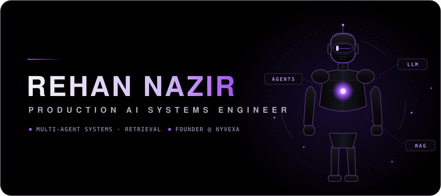
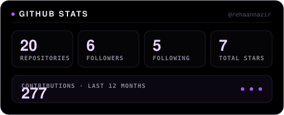
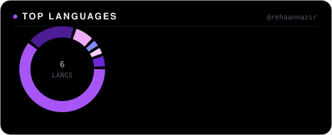
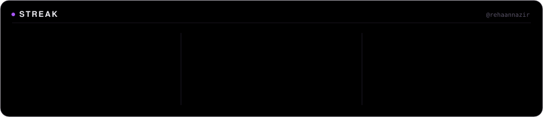

<!--
  Profile README — rehaannazir
  Visual assets are self-hosted animated SVGs in /assets.
  Signal cards (stats, languages, streak) are generated from real GitHub
  data and require manual resync when the underlying numbers change.
-->

 

I design and ship AI systems that run without a human in the loop — agent
orchestration, retrieval pipelines, and the infrastructure that keeps them
reliable in production.

Founder at **Nyvexa**. Based in Lahore, Pakistan.

 

## Focus

- Multi-agent orchestration and coordination
- Retrieval-augmented generation and knowledge systems
- Memory architectures for long-horizon agent tasks
- Typed, observable service layers for LLM applications
- Evaluation and reliability for non-deterministic systems

 

## Selected Systems

**[Nyvexa Agent API](https://github.com/rehaannazir/Nyvexa-Agent-API)** — FastAPI and LangChain agent service, the orchestration layer behind Nyvexa.

**[Lead Enrichment Pipeline](https://github.com/rehaannazir/Lead_Enrichment-Automation-n8n-)** — Production n8n pipeline: validation, enrichment, CRM dedup, scoring, routing.

**[AI Content Automation](https://github.com/rehaannazir/AI-Content-Automation)** — LLM-driven content pipeline, brief to publish-ready output with no manual steps.

**[Gemini API Deep Dive](https://github.com/rehaannazir/Gemini-API-Deep-Dive)** — Structured output, function calling, streaming, and token control in practice.

**[FastAPI JWT Book Store](https://github.com/rehaannazir/FastAPI-JWT-Book-Store)** — Typed REST API with JWT auth, ownership-scoped resources, and test coverage.

**[DocQA CLI](https://github.com/rehaannazir/DocQA-CLI)** — Command-line document Q&A over local files using retrieval-augmented generation.

 

## AEGIS

An early-stage research initiative on **modular agent architectures** — treating
memory, retrieval, and orchestration as separable, swappable layers rather than
one monolithic agent loop.

Status: design phase. Repository and writeup to follow.

Research threads under exploration:

- Memory architectures for long-horizon tasks — TODO
- Orchestration and reasoning boundary design — TODO
- Retrieval as a first-class, replaceable component — TODO
- Evaluation methodology for agent reliability — TODO

 

## Current Work

Building the agent orchestration layer at Nyvexa, and using
[AI System Engineering](https://github.com/rehaannazir/AI-System-Engineering)
as an open sandbox for architecture and coordination experiments.

 

## Systems Overview

A cinematic walkthrough of how a request becomes a production AI system —
from intent detection through retrieval, reasoning, agent execution,
automation, and deployment.

 

## Signals

  

  

  

 

## Contact

[rehannazir.com](https://rehannazir.com) &nbsp;·&nbsp;
[LinkedIn](https://www.linkedin.com/in/rehan-nazir-530597332) &nbsp;·&nbsp;
[rehaan689nazir@gmail.com](mailto:rehaan689nazir@gmail.com)
